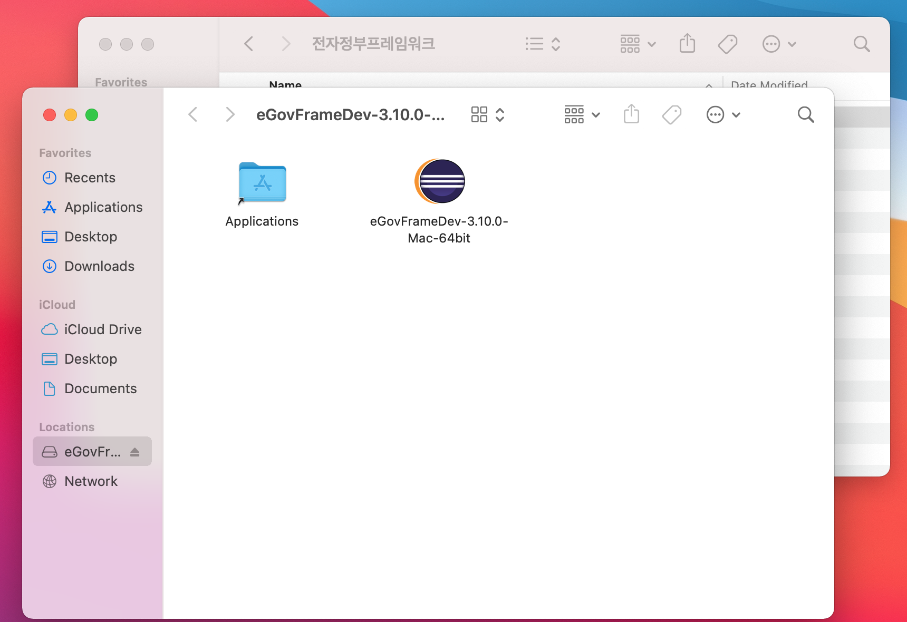

참고 블로그)
[mac 전자정부 프레임워크 설치 및 게시판 만들기](https://trytoso.tistory.com/1308)
 
 
 

## 1. 다운받기

[https://www.egovframe.go.kr/home/sub.do?menuNo=41](https://www.egovframe.go.kr/home/sub.do?menuNo=41)

위의 링크로 들어가 개발자용 개발환경 중 최신 릴리즈를 다운받는다

(개발자용 개발환경 for Mac 64bit(Implementation Tool) Version 3.10.0)
 
 
 

## 2. 압축해제

<!--  -->
 
 
 

## 3. 이클립스 실행

압축 해제 후 워크스페이스를 지정하면 아무것도 없는 깨끗한 창이 나온다.

 
우측 상단의 perspective 창 (돋보기 아이콘 옆) 을 열어서 
 
 

 
eGovFrame 선택!
 
 

 

file > new > eGovFrame Web Project로 열기

또는 프로젝트가 전혀 없다면 왼쪽에서 바로 선택

 
 
 

## 4. 프로젝트 생성

1) 프로젝트명과 groupId 적고 next

 

2) Generate Example 선택하고 Finish

모두 완료되면 샘플 프로젝트가 생성된다.

 
 
 

## 5. 서버(톰캣) 설정

하단의 No servers are available.~~ 클릭

1) 본인이 가지고 있는 톰캣 버전 선택

나는 이미 서버를 설치했으므로 runtime environment가 셋팅되어 있다. 

2) Tomcat installation directory에 본인 톰캣 경로를 지정한다. 지정하고 Finish

3) 서버 설치가 완료되면 설치된 톰캣 서버를 더블 클릭해서 설정창을 연다. (Module)

4) 우측의 Add Web Module... 클릭

Modules에서 클릭 후 Path를 /로 변경하고 OK

*혹시 Path가 / 로 되어있지 않다면 Edit을 눌러 직접 변경한다.
 
 
 
## 6. 서버 실행

서버를 키고 localhost:8080으로 들어가면

샘플 CRUD 게시판이 나오면 정상 :)